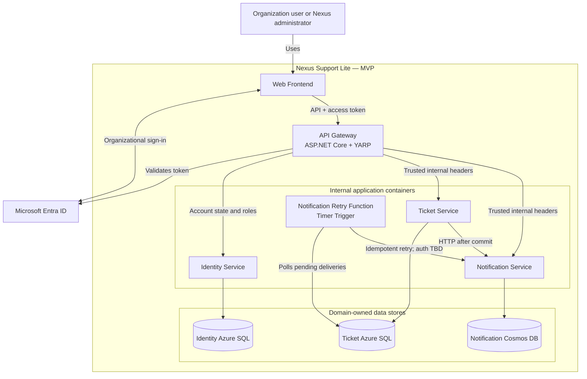

# Nexus Support Lite

## Container Diagram

**Status:** Architecture synchronized  
**Version:** 2.0  
**Date:** August 1, 2026  
**Related documents:** `PRODUCT.md`, `PERSONAS.md`, `USER_FLOWS.md`, `SYSTEM_CONTEXT.md`, `ADR-001-MICROSERVICES-ARCHITECTURE.md`, `ADR-002-MULTITENANT-IDENTITY.md`, `ADR-003-PERSISTENCE-STRATEGY.md`, `ADR-004-API-GATEWAY-WITH-YARP.md`

## 1. Purpose

This document describes the C4 level 2 containers inside the Nexus Support Lite boundary for the MVP. It defines their responsibilities, technologies already selected by ADRs, data ownership, trust boundaries, and principal communication paths.

Detailed Azure resource topology belongs in `DEPLOYMENT_DIAGRAM.md`. Business ownership and service boundaries should be refined in `DOMAIN_BOUNDARIES.md`.

## 2. Architectural Shape

Nexus Support Lite uses an independently deployed web frontend and backend microservices. The frontend reaches backend capabilities exclusively through a single API Gateway.

The MVP contains three business services:

- **Identity Service**
- **Ticket Service**
- **Notification Service**

It also contains a **Notification Retry Function** belonging to the Tickets domain. It processes durable pending deliveries without introducing Azure Service Bus or another message broker.

Each domain owns its data. No service may read or write data owned by another domain. Identity and Tickets use separate Azure SQL databases, while Notifications uses Azure Cosmos DB. Communication between Tickets and Notifications is synchronous HTTP after the ticket transaction is committed, with a durable retry mechanism for failures.

Knowledge Base, AI capabilities, Azure Service Bus, and other message brokers are outside the MVP.

## 3. MVP Containers

| Container | Technology / storage | Responsibility | Main interactions |
| --- | --- | --- | --- |
| Web Frontend | Web application; framework TBD | Provides the responsive browser interface and initiates Microsoft Entra ID sign-in. | Calls only the API Gateway and redirects users to Entra ID for authentication. |
| API Gateway | ASP.NET Core with YARP on Azure Container Apps | Single public backend entry point. Validates Entra ID tokens, resolves the organization exclusively from the validated `tid` claim, removes client-supplied identity headers, obtains local account state and roles, applies tenant rate limiting, and routes requests using static versioned configuration. | Calls Identity, Tickets, and Notifications through internal ingress. |
| Identity Service | Internal microservice on Azure Container Apps | Manages organizations, users, local account state, roles, and first-login provisioning as Requester. Provides account state and roles to the Gateway. | Receives trusted internal calls from the Gateway and accesses only Identity Database. |
| Ticket Service | Internal microservice on Azure Container Apps | Owns topics, incidents, assignments, priorities, comments, attachment references, resolution data, and incident history. Enforces workflow and authorization rules. | Receives trusted internal calls from the Gateway, accesses Ticket Database, and requests notification creation over HTTP after committing ticket changes. |
| Notification Service | Internal microservice on Azure Container Apps | Creates, stores, lists, and updates persistent in-app notifications, including read/unread state and history. Uses operation identifiers to make creation idempotent. | Receives trusted internal calls from the Gateway and notification-creation calls from the Tickets domain; accesses only Notification Database. |
| Notification Retry Function | Azure Function with configurable one-minute Timer Trigger | Finds pending notification deliveries owned by the Tickets domain and retries them using Polly policies. Uses its own managed identity to access Ticket Database. | Reads and updates pending deliveries in Ticket Database and calls Notification Service. Authentication for this latter call remains TBD. |
| Identity Database | Azure SQL Database | Stores organizations, users, roles, account state, and identity-related tenant data. Shared across organizations with logical isolation by `TenantId`. | Accessible only by Identity Service through its own managed identity. |
| Ticket Database | Azure SQL Database | Stores ticket-domain data and durable pending notification deliveries. Shared across organizations with logical isolation by `TenantId`. | Accessible by Ticket Service and Notification Retry Function, both components of the Tickets domain, through distinct managed identities and least-privilege permissions. |
| Notification Database | Azure Cosmos DB, Session consistency | Stores persistent notification history and read/unread state. Uses hierarchical partitioning by `TenantId` and `UserId`. | Accessible only by Notification Service through its own managed identity. |

The Gateway implementation does not constrain downstream services to .NET. A future service may use Python or another runtime if it preserves the documented HTTP contracts, security controls, and ownership boundaries.

## 4. Container Diagram

## 5. Identity and Trust Flow

1. The Web Frontend uses the frontend multitenant App Registration to initiate sign-in for organizational Microsoft Entra ID accounts.
2. During organization onboarding, an administrator grants consent to the frontend and API multitenant App Registrations.
3. The frontend sends the access token to the API Gateway.
4. The Gateway validates signature, issuer, audience, and expiration.
5. The organization is resolved exclusively from the validated `tid` claim. A tenant identifier supplied separately by the frontend is never trusted.
6. The Gateway rejects tenants that are not registered and enabled in Nexus.
7. The Gateway queries Identity for the local user, account state, and Nexus roles. On first login, Identity creates the user as a Requester using validated token data.
8. The Gateway caches the account and role result for five minutes. Role or account-state changes invalidate the corresponding cache entry immediately.
9. Before forwarding, the Gateway removes equivalent identity headers supplied by the client and creates trusted internal headers containing the validated user, `TenantId`, and roles.
10. Each internal microservice validates its own distinct shared internal key and applies functional authorization using the trusted identity context.
11. Internal ingress and network isolation prevent direct public access to microservices.

The Gateway is the only component that validates end-user Entra ID access tokens. Internal services do not duplicate that validation.

## 6. Ticket and Notification Flow

1. The frontend sends a ticket command through the Gateway.
2. The Gateway authenticates the request and routes it to Ticket Service with trusted identity headers and the Ticket Service's internal key.
3. Ticket Service applies tenant isolation, role authorization, and workflow rules.
4. Ticket Service commits the ticket transaction to Ticket Database.
5. Only after the commit succeeds, Ticket Service calls Notification Service over internal HTTP.
6. The request includes a unique operation identifier. Notification Service uses it to prevent duplicate notifications.
7. Immediate calls use Polly with controlled timeout, exponential backoff retries, a configurable maximum attempt count, and circuit breaker.
8. A notification failure never reverses the committed ticket operation.
9. If immediate delivery still fails, Ticket Service stores a durable pending delivery in Ticket Database with the operation identifier, attempt count, next attempt time, and last error.
10. The Notification Retry Function runs initially every minute, with configurable frequency, and claims eligible deliveries safely.
11. The Function retries delivery using Polly. When the configurable maximum is exhausted, the delivery becomes `Failed` for manual review.
12. Notification Service stores successful notifications in Cosmos DB. Marking a notification as read changes its state but does not delete it.

The mechanism used by the Retry Function to authenticate its HTTP call to Notification Service remains **TBD**. It must be decided before implementation and must not be inferred from the Gateway's end-user flow.

## 7. Communication and Security Rules

- The Web Frontend reaches backend services only through the API Gateway.
- YARP routes are static, versioned in the repository, and use stable internal Azure Container Apps names for the MVP.
- Dynamic service discovery is outside the MVP.
- The Gateway applies configurable rate limiting by `TenantId`; per-user rate limiting is outside the MVP.
- Business microservices have internal ingress and are not publicly reachable.
- The Gateway uses a distinct shared internal key for each microservice. These values are stored in GitHub Actions Secrets and injected during deployment.
- Client-supplied identity headers are removed before the Gateway adds trusted internal identity headers.
- Each microservice performs its own functional authorization.
- No domain reads or writes another domain's database.
- Ticket-to-notification communication uses HTTP; Azure Service Bus and other brokers are not part of the MVP.
- The Retry Function has its own managed identity and least-privilege access to Ticket Database.
- Identity, Ticket, and Notification services each use their own managed identity for their respective data store.
- Database access uses Microsoft Entra ID rather than stored database usernames or passwords.
- Azure SQL migrations for Identity and Tickets run as controlled CI/CD pipeline steps and never automatically at application startup.

## 8. Data Ownership

| Data | Authoritative owner |
| --- | --- |
| Organizations and organization status | Identity Service |
| Users, local account status, and Nexus roles | Identity Service |
| Topics and responsible-agent relationships | Ticket Service |
| Incidents, assignments, comments, priorities, resolutions, and history | Ticket Service |
| Attachment metadata or references associated with incidents | Ticket Service |
| Pending notification deliveries and retry state | Tickets domain |
| Notifications, recipients, history, and read/unread state | Notification Service |

The Notification Retry Function is part of the Tickets domain; its access to Ticket Database does not cross a domain boundary. Physical attachment storage remains TBD, while Ticket Service remains the business owner of attachment references and lifecycle rules.

## 9. Tenant and Data Isolation

- Identity and Tickets each use one database shared by all organizations, with logical isolation through `TenantId`.
- Identity and Ticket databases remain physically separate even if they initially share the same logical Azure SQL server.
- Notification data uses a Cosmos DB hierarchical partition key of `TenantId` followed by `UserId`.
- Cosmos DB uses Session consistency.
- Every business query and mutation must be scoped to the trusted `TenantId`.
- Each service owns and enforces isolation for its data.
- Managed identities receive access only to the data required by their container and domain.
- The Nexus Global Administrator boundary defined in `SYSTEM_CONTEXT.md` remains separate from tenant operational access.

## 10. MVP Scope

### Included

- Web Frontend.
- ASP.NET Core/YARP API Gateway.
- Identity, Ticket, and Notification services.
- Identity and Ticket Azure SQL databases.
- Notification Azure Cosmos DB.
- HTTP delivery from Tickets to Notifications.
- Idempotency, Polly retries, exponential backoff, circuit breaker, and durable pending deliveries.
- Timer-triggered Notification Retry Function.
- Microsoft Entra ID integration and managed identities.
- Tenant-level rate limiting.

### Explicitly outside the MVP

- Knowledge Base Service.
- AI service or AI provider integration.
- Azure Service Bus or any other message broker.
- Dynamic service discovery.
- Per-user rate limiting.
- Automatic database migration at application startup.

## 11. Remaining Decisions

The following decisions remain open and must not be inferred by implementation:

- Frontend framework and hosting technology.
- Runtime/language choices for individual downstream services where not already selected.
- Authentication mechanism for Notification Retry Function calls to Notification Service.
- Exact timeout, retry, circuit-breaker, and rate-limit values; these will be configurable and finalized through load and resilience testing.
- Physical attachment storage and malware scanning.
- Observability, alerting, and detailed deployment topology.

## 12. Container-Level Acceptance Criteria

1. The Web Frontend reaches backend capabilities through one public API Gateway.
2. The Gateway uses ASP.NET Core with YARP, validates end-user tokens, derives the tenant only from `tid`, and uses static versioned routes.
3. Business microservices remain private and accept trusted identity context only from authorized internal callers.
4. Identity, Ticket, and Notification services enforce their own functional authorization and tenant isolation.
5. Identity and Tickets persist data in separate Azure SQL databases; Notifications persists data in Cosmos DB partitioned by tenant and user.
6. A committed ticket operation remains successful when notification delivery fails.
7. Notification creation is idempotent by operation identifier.
8. Failed notification deliveries survive container restarts and are retried by the Timer-triggered Azure Function.
9. Notification history remains persistent after notifications are marked as read.
10. No service crosses another domain's data boundary.
11. Knowledge Base, AI capabilities, Service Bus, and other brokers are absent from the MVP.
12. The Retry Function-to-Notification authentication mechanism remains visibly unresolved until a dedicated decision is made.

## 13. Next Architecture Document

The next document is `DEPLOYMENT_DIAGRAM.md`. It should map these validated containers to Azure resources, network boundaries, environments, managed identities, data services, and operational dependencies without changing their responsibilities.
