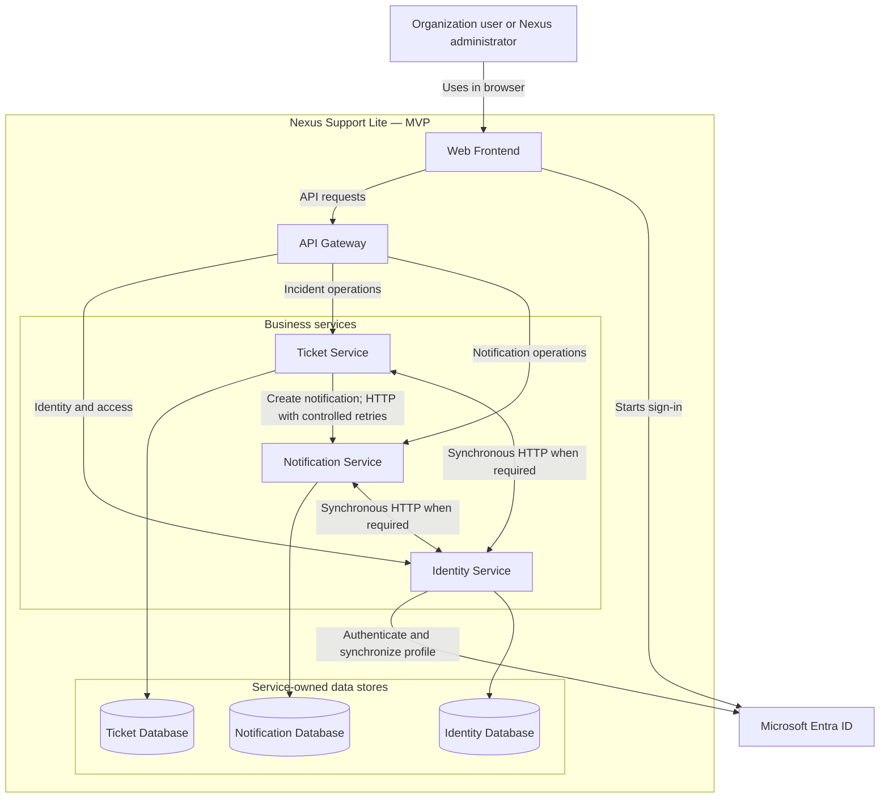

# Nexus Support Lite

## Container Diagram

**Status:** Discovery validated  
**Version:** 1.1  
**Date:** August 1, 2026  
**Related documents:** `PRODUCT.md`, `PERSONAS.md`, `USER_FLOWS.md`, `SYSTEM_CONTEXT.md`

## 1. Purpose

This document describes the principal executable applications, services, and data stores inside the Nexus Support Lite boundary for the MVP. It defines their responsibilities and communication paths without selecting specific frameworks, database engines, messaging products, cloud services, or deployment topology.

Detailed infrastructure belongs in `DEPLOYMENT_DIAGRAM.md`. Business ownership and service boundaries should be refined in `DOMAIN_BOUNDARIES.md` and supported by the relevant Architecture Decision Records.

## 2. Architectural Shape

Nexus Support Lite uses an independently deployed web frontend and API backend organized around microservices. The frontend accesses backend capabilities through a single API Gateway.

The MVP contains three business services:

- **Identity Service**
- **Ticket Service**
- **Notification Service**

Each service owns its data store and must not read or write another service's database directly. For the MVP, services communicate synchronously through HTTP. Asynchronous messaging remains a future evolution that must be justified by reliability, scale, or fan-out requirements.

The architecture anticipates a future **Knowledge Base Service**, but that service is outside the MVP and is not an implemented container in the current design.

## 3. MVP Containers

| Container | Responsibility | Owns data | Main interactions |
| --- | --- | --- | --- |
| Web Frontend | Provides the responsive browser interface for Requesters, Agents, Organization Administrators, and Nexus Global Administrators. | No authoritative business data. | Uses the API Gateway; initiates the Entra ID sign-in experience. |
| API Gateway | Provides the single backend entry point, routes requests to the appropriate service, and preserves authenticated tenant and user context. | No business data. | Receives frontend requests and routes them to Identity, Ticket, or Notification services. |
| Identity Service | Manages organizations, identity-provider configuration, local users, roles, account state, and tenant membership. Delegates initial authentication to Microsoft Entra ID and provisions first-time users as Requesters. | Organizations, IdP configuration, users, roles, and identity-related tenant data. | Communicates with Entra ID; serves identity and authorization capabilities through the gateway; may provide validated identity or authorization context to other services. |
| Ticket Service | Owns topics, incidents, assignments, priorities, comments, attachment references, resolution data, and incident history. Enforces the incident workflow and atomic incident assignment. | All ticket-domain operational data. | Serves ticket operations through the gateway and requests notification creation from the Notification Service over HTTP. |
| Notification Service | Creates, stores, lists, and updates internal notifications. Owns notification history and each notification's read/unread state. | Notifications, recipients, delivery state, and read/unread state. | Serves notification queries and commands through the gateway; receives notification-creation requests from the Ticket Service over HTTP. |
| Identity Database | Persists data owned exclusively by the Identity Service. | Identity-domain data. | Accessible only by the Identity Service. |
| Ticket Database | Persists data owned exclusively by the Ticket Service. | Ticket-domain data. | Accessible only by the Ticket Service. |
| Notification Database | Persists data owned exclusively by the Notification Service. | Notification-domain data. | Accessible only by the Notification Service. |

## 4. Container Diagram

The synchronous links show permitted interaction, not a requirement that every request call the Identity Service. Authentication and authorization details, token propagation, and policy evaluation remain architecture decisions to be documented separately.

## 5. Principal Interaction Paths

### 5.1 Authentication and First Access

1. The user starts sign-in from the Web Frontend.
2. Microsoft Entra ID authenticates the user for the organization's registered tenant.
3. The authenticated request reaches Nexus through the API Gateway.
4. The Identity Service resolves the organization from the tenant ID, validates that the organization and local account are enabled, and synchronizes the user's name and email.
5. On first access, the Identity Service creates the local user with the Requester role.
6. The frontend receives only the capabilities and data permitted for the active tenant and role.

### 5.2 Ticket Operations

1. The Web Frontend sends incident commands and queries through the API Gateway.
2. The gateway routes them to the Ticket Service.
3. The Ticket Service validates the tenant, role, topic, assignment, and workflow rules required by the operation.
4. The Ticket Service reads or changes only its own database.
5. Relevant changes trigger an HTTP request to the Notification Service when an in-app notification is required.

### 5.3 Internal Notifications

1. After committing the ticket change, the Ticket Service requests notification creation from the Notification Service through HTTP.
2. If the request fails, the Ticket Service applies controlled retries and records the final failure.
3. The Notification Service determines the recipients according to the event and validated product rules.
4. It creates persistent internal notifications in its own database.
5. Users retrieve and update their notifications through the API Gateway.
6. Marking a notification as read or unread is handled exclusively by the Notification Service; an unread notification contributes to the pending count shown by the bell.
7. A notification failure never rolls back or corrupts the already committed ticket change; the MVP accepts that a notification may be delayed or, after retries are exhausted, not be created.

The exact event catalog and recipient resolution rules should be specified separately and must remain consistent with `USER_FLOWS.md`.

## 6. Communication Rules

- The frontend communicates with backend services only through the API Gateway.
- A service never accesses another service's database.
- HTTP is used when a request requires an immediate response.
- Ticket-to-notification communication uses HTTP with controlled retries in the MVP.
- Every request, command, query, and event must carry or resolve sufficient tenant context to preserve organization isolation.
- Authorization must be enforced by backend services and cannot depend solely on frontend visibility.
- Failure of the Notification Service must not corrupt a successfully committed ticket operation; retry limits and operational recovery remain pending architectural decisions.

## 7. Data Ownership

| Data | Authoritative owner |
| --- | --- |
| Organizations and organization status | Identity Service |
| Identity-provider configuration | Identity Service |
| Users, local account status, and roles | Identity Service |
| Topics and responsible-agent relationships | Ticket Service |
| Incidents, assignments, comments, priorities, resolutions, and history | Ticket Service |
| Attachment metadata or references associated with incidents | Ticket Service |
| Notifications, recipients, history, and read/unread state | Notification Service |

Physical attachment storage is not selected in this document. The Ticket Service remains the business owner of incident attachment references and lifecycle rules even if file bytes are later placed in specialized object storage.

## 8. Tenant and Trust Boundaries

- The Identity Service establishes and validates the organization associated with the authenticated tenant ID.
- The API Gateway propagates authenticated user and tenant context but does not replace authorization inside each service.
- Each service must enforce tenant isolation for its own operations and data.
- Service-owned databases must prevent cross-tenant data exposure even when multiple tenants share physical infrastructure.
- Inter-service requests must include trustworthy tenant and user context, and the receiving service must enforce it before processing or persisting data.
- The Nexus Global Administrator's identity capabilities must remain separated from tenant operational access, as defined in `SYSTEM_CONTEXT.md`.

## 9. MVP Scope and Future Containers

### Included in the MVP

- Web Frontend.
- API Gateway.
- Identity Service and its database.
- Ticket Service and its database.
- Notification Service and its database.
- HTTP communication from Tickets to Notifications with controlled retries and failure logging.
- Microsoft Entra ID integration.

### Prepared but not included

The architecture should permit a future Knowledge Base Service with its own responsibility and data ownership. No knowledge-base functionality, API, database, event contract, or user flow is part of the MVP. It must not be implemented merely because the architecture anticipates it.

## 10. Unresolved Architecture Decisions

This document intentionally does not decide:

- Frontend framework or hosting technology.
- Backend framework and runtime.
- API Gateway product or implementation pattern.
- Database engines or whether different services use different engines.
- Exact HTTP retry limits, timeout policy, and operational alert thresholds.
- Criteria for adopting asynchronous messaging in a future phase.
- Authentication protocol, token format, service-to-service identity, or authorization policy implementation.
- How role or topic changes are propagated immediately across active sessions.
- Attachment byte storage and malware-scanning mechanism.
- AI provider, model, integration container, or deployment boundary.
- Observability, secrets management, caching, or deployment topology.

These decisions should be captured in `DEPLOYMENT_DIAGRAM.md`, `DOMAIN_BOUNDARIES.md`, or focused ADRs as appropriate.

## 11. Required Synchronization with Existing Documentation

Before implementation, the documentation set should be synchronized so that:

- `PRODUCT.md` reflects the current Entra ID tenant-ID access flow established in `SYSTEM_CONTEXT.md`.
- Notification behavior follows the latest rules in `USER_FLOWS.md`, including cases where topic transfer does not notify destination-topic agents.
- Identity, ticket, and notification ownership introduced here is reflected consistently in later domain and deployment documents.

## 12. Container-Level Acceptance Criteria

1. The Web Frontend reaches backend capabilities through one API Gateway entry point.
2. Identity, Ticket, and Notification services persist data only in their respective stores.
3. No service reads or writes another service's database directly.
4. The Identity Service delegates initial authentication to Microsoft Entra ID while retaining local organization, user, role, and account-state responsibilities.
5. A committed ticket operation remains successful when notification delivery fails.
6. The Notification Service creates and retains internal notifications requested by the Ticket Service and owns their read/unread state.
7. A notification marked unread contributes again to the user's pending-notification count.
8. Tenant context is enforced at the gateway, service, database-access, and event-processing boundaries.
9. Knowledge Base functionality is absent from the MVP implementation.

## 13. Next Architecture Document

The next recommended document is `DEPLOYMENT_DIAGRAM.md`. It should map the validated containers to runtime infrastructure, network boundaries, environments, data services, and operational dependencies without changing their responsibilities.
