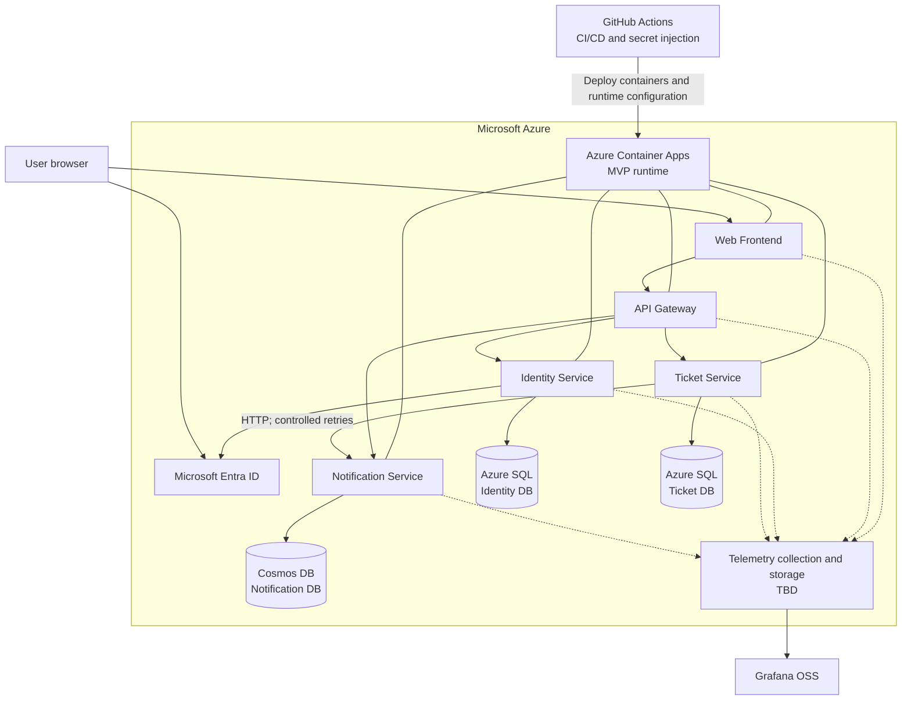

# Nexus Support Lite

## Deployment Diagram

**Status:** Discovery validated
**Version:** 1.1
**Date:** August 1, 2026
**Related documents:** `PRODUCT.md`, `PERSONAS.md`, `USER_FLOWS.md`, `SYSTEM_CONTEXT.md`, `CONTAINER_DIAGRAM.md`

## 1. Purpose

This document maps the Nexus Support Lite MVP containers to the currently agreed deployment infrastructure in Microsoft Azure. It records confirmed choices, explicit exclusions, and decisions that remain open.

## 2. Deployment Principles

- Microsoft Azure is the initial cloud platform.
- The frontend, API Gateway, and business services are independently deployable containers.
- Azure Container Apps is the container execution platform for the MVP, as recorded in `ADR-001-AZURE-CONTAINER-APPS.md`.
- Each microservice owns its database and cannot access another service's data store directly.
- The MVP favors low-cost or eligible free-tier Azure resources. Eligibility, quotas, regional availability, and current pricing must be verified for the target subscription before provisioning.
- Service Bus, Application Insights, Azure Key Vault, and Azure Managed Grafana are not part of the MVP.

## 3. Runtime and Azure Services

| Deployment element | Selected service or status | Purpose |
| --- | --- | --- |
| Web Frontend | Azure Container Apps | Serves the browser application. |
| API Gateway | Azure Container Apps | Exposes the single backend entry point and routes requests. |
| Identity Service | Azure Container Apps | Manages organizations, IdP configuration, users, and roles. |
| Ticket Service | Azure Container Apps | Manages topics, incidents, assignments, comments, and history. |
| Notification Service | Azure Container Apps | Manages internal notifications and read/unread state. |
| Identity Database | Azure SQL Database | Stores Identity-owned relational data. |
| Ticket Database | Azure SQL Database | Stores Ticket-owned relational data. |
| Notification Database | Azure Cosmos DB | Stores Notification-owned data. |
| Identity Provider | Microsoft Entra ID | Authenticates users for registered organization tenants. |
| Dashboards | Grafana OSS | Visualizes operational telemetry. It does not collect or store telemetry by itself. |
| Telemetry pipeline | **TBD** | Collects and stores metrics and logs for Grafana; candidates may be evaluated later. |
| CI/CD | GitHub Actions | Builds, tests, publishes, and deploys the application. |
| Secret source | GitHub Actions Secrets | Holds deployment secrets and injects them into the deployment process. |

Identity and Ticket use separate logical databases under their respective service ownership. Whether they share one Azure SQL logical server for cost efficiency is an infrastructure decision and does not permit cross-service table access.

## 4. Deployment Diagram

The runtime box represents the Azure Container Apps environment and its independently deployable container apps. Environment boundaries and workload profiles remain pending infrastructure design.

## 5. Communication and Failure Behavior

- Browser traffic enters backend capabilities only through the API Gateway.
- Backend services communicate through HTTP in the MVP.
- The Ticket Service commits the ticket operation before requesting creation of the corresponding notification.
- Ticket-to-Notification calls use controlled timeouts and retries.
- If all notification attempts fail, Nexus records the error and preserves the successful ticket change.
- The accepted MVP trade-off is that an internal notification may be delayed or may not be created.
- Azure Service Bus and other asynchronous brokers remain possible future additions if delivery guarantees, multiple consumers, or scale justify them.

## 6. Data Deployment and Isolation

- Identity and Ticket data are stored in Azure SQL Database, in separate service-owned databases.
- Notification data is stored in Azure Cosmos DB and is accessible only by the Notification Service.
- Every database access must be scoped to the active organization.
- Database credentials and connection information are supplied to only the owning service.
- No service may join, query, or mutate tables or containers owned by another service.
- Backups, restore objectives, retention, partitioning, capacity limits, and regional replication remain pending operational decisions.

## 7. CI/CD and Secrets

GitHub Actions is the CI/CD mechanism for the MVP. The intended flow is:

1. Build and test each deployable component.
2. Build and publish versioned container images.
3. Retrieve deployment values from GitHub Actions Secrets.
4. Inject secrets as runtime configuration during deployment.
5. Deploy the selected version to the Azure execution platform.

Security constraints:

- Secrets must never be committed to the repository.
- Secrets must never be embedded in Docker images, build artifacts, logs, or frontend bundles.
- Secrets are injected only into the runtime components that require them.
- Pull-request workflows from untrusted forks must not receive production secrets.
- Secret rotation, environment protection, deployment approvals, and least-privilege Azure access require dedicated CI/CD design.

GitHub Actions Secrets are an accepted MVP compromise due to cost constraints. Reassessment is required if compliance, rotation, auditability, or operational scale increases.

## 8. Observability

Grafana OSS is selected as the visualization layer. Because Grafana does not by itself collect or persist application telemetry, the following remain **TBD**:

- Instrumentation standard and libraries.
- Metrics collector and time-series store.
- Log collector and log store.
- Trace collection and storage.
- Hosting location and persistence for Grafana.
- Alert routing and retention.

Application Insights and Azure Managed Grafana are excluded from the MVP. The observability design must still provide health visibility for the gateway, each service, databases, failed notification calls, and tenant-isolation errors.

## 9. Environments and Network Boundaries

The exact number of environments is not yet defined. At minimum, production secrets and configuration must be isolated from non-production values.

The following remain unresolved:

- Public ingress and TLS termination.
- Custom domain and certificate management.
- Private networking or public database endpoints.
- Firewall and IP restriction strategy.
- Container registry.
- Runtime scaling, health probes, and availability-zone strategy.
- Development, test, staging, and production topology.

## 10. Explicit MVP Exclusions

- Azure Service Bus or another event broker.
- Application Insights.
- Azure Key Vault.
- Azure Managed Grafana.
- Knowledge Base deployment.
- Additional identity providers beyond Microsoft Entra ID.
- Azure Kubernetes Service; it remains a future alternative subject to the reconsideration triggers in ADR-001.

## 11. Unresolved Deployment Decisions

1. Define the Azure Container Apps environment, workload profiles, ingress, revisions, health probes, and scaling limits.
2. Select the container registry and image-promotion strategy.
3. Define the Grafana telemetry collection and storage stack.
4. Define TLS, networking, and database access controls.
5. Define environments and deployment promotion rules.
6. Define backup, restore, retention, scaling, and availability objectives.
7. Define attachment byte storage and malware scanning.
8. Define the AI provider and deployment boundary used for topic and priority suggestions.

## 12. Deployment-Level Acceptance Criteria

1. All browser API traffic enters through one API Gateway endpoint.
2. Identity, Ticket, and Notification services can be deployed independently on the selected Azure runtime.
3. Each service can access only its own database and secrets.
4. Cross-tenant data cannot be returned by application or database operations.
5. A Notification Service outage cannot undo a successfully committed ticket operation.
6. Exhausted notification retries are recorded and visible operationally.
7. Production secrets are absent from the repository, images, artifacts, logs, and frontend code.
8. GitHub Actions injects secrets only during authorized deployments.
9. Grafana can visualize health and operational telemetry once the telemetry pipeline is selected.
10. Knowledge Base, Service Bus, Application Insights, Key Vault, and Managed Grafana are absent from the MVP deployment.

## 13. Required Documentation Synchronization

- `CONTAINER_DIAGRAM.md` must represent HTTP-based notification creation and remove the Event Broker from the MVP.
- `PRODUCT.md` must adopt the Entra tenant-ID access flow defined in `SYSTEM_CONTEXT.md`.
- The Azure Container Apps decision is recorded in `ADR-001-AZURE-CONTAINER-APPS.md`.

## 14. Next Architecture Document

The next document is `DOMAIN_BOUNDARIES.md`. It should refine domain ownership, commands, dependencies, and integration boundaries without coupling the domains to the Azure deployment choices recorded here.
