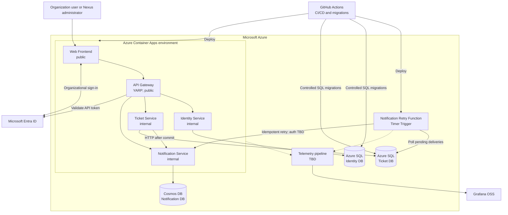

# Nexus Support Lite

## Deployment Diagram

**Status:** Architecture synchronized  
**Version:** 2.0  
**Date:** August 1, 2026  
**Related documents:** `PRODUCT.md`, `PERSONAS.md`, `USER_FLOWS.md`, `SYSTEM_CONTEXT.md`, `CONTAINER_DIAGRAM.md`, `DOMAIN_BOUNDARIES.md`, `ADR-001-MICROSERVICES-ARCHITECTURE.md`, `ADR-002-MULTITENANT-IDENTITY.md`, `ADR-003-PERSISTENCE-STRATEGY.md`, `ADR-004-API-GATEWAY-WITH-YARP.md`

## 1. Purpose

This document maps the validated Nexus Support Lite MVP containers to Microsoft Azure resources and deployment boundaries. Unvalidated operational details remain explicitly marked as `TBD`.

## 2. Deployment Principles

- Azure Container Apps hosts the Web Frontend, API Gateway, Identity Service, Ticket Service, and Notification Service.
- An Azure Function processes durable pending notification deliveries on a configurable timer.
- The API Gateway is the only publicly reachable backend component; business services use internal ingress.
- Each domain owns its data and workloads use distinct managed identities with least-privilege permissions.
- The MVP favors low-cost or free-tier-eligible resources; actual pricing, quotas, and regional availability must be verified before provisioning.
- Service Bus, other brokers, Application Insights, Key Vault, Managed Grafana, Knowledge Base, and AI capabilities are outside the MVP.

## 3. Azure Resource Mapping

| Element | Azure service / technology | Responsibility |
| --- | --- | --- |
| Web Frontend | Azure Container Apps | Public browser interface using the frontend multitenant Entra App Registration. |
| API Gateway | Azure Container Apps; ASP.NET Core + YARP | Only public backend ingress; validates API tokens, derives `TenantId` from `tid`, applies tenant rate limiting, and uses static versioned routes. |
| Identity Service | Azure Container Apps; internal ingress | Manages organizations, local users, account state, and Nexus roles. |
| Ticket Service | Azure Container Apps; internal ingress | Manages tickets and durable pending notification deliveries. |
| Notification Service | Azure Container Apps; internal ingress | Manages persistent in-app notification history and read/unread state. |
| Notification Retry Function | Azure Functions; Timer Trigger | Polls Ticket Database and retries pending notification deliveries. |
| Identity Database | Azure SQL Database | Separate Identity-owned database, logically isolated by `TenantId`. |
| Ticket Database | Azure SQL Database | Separate Tickets-owned database containing tickets and pending deliveries. |
| Notification Database | Azure Cosmos DB | Session consistency; hierarchical partition key `TenantId` / `UserId`. |
| Identity Provider | Microsoft Entra ID | Organizational authentication through shared frontend and API multitenant App Registrations. |
| Container Registry | **TBD** | Stores versioned container images. |
| Dashboards | Grafana OSS | Visualizes telemetry; hosting and persistence remain TBD. |
| Telemetry pipeline | **TBD** | Collects and stores metrics, logs, and traces. |
| CI/CD | GitHub Actions | Builds, tests, migrates databases, and deploys workloads. |
| Deployment secrets | GitHub Actions Secrets | Stores deployment values and distinct internal service keys. |

Identity and Ticket databases may share an Azure SQL logical server initially, but remain separate databases with separate permissions.

## 4. Deployment Diagram

The Container Apps environment, workload profiles, revision strategy, health probes, and scaling limits remain infrastructure decisions. The diagram does not imply public ingress for business services.

## 5. Identity and Trust Boundaries

1. The frontend and API use separate multitenant Microsoft Entra ID App Registrations.
2. An organization administrator grants consent to both during onboarding.
3. The frontend sends the API access token only to the Gateway.
4. The Gateway validates signature, issuer, audience, and expiration and derives the organization exclusively from `tid`.
5. The Gateway queries Identity for account state and Nexus roles, cached for five minutes with immediate invalidation after changes.
6. It removes client-supplied identity and internal-key headers, then adds trusted identity headers and the destination service's distinct internal key.
7. Each microservice validates its key and enforces functional authorization.
8. Internal ingress and network controls prevent bypassing the Gateway.
9. The Retry Function has its own managed identity for Ticket Database. Its authentication to Notification Service remains **TBD**.

## 6. Data Access

| Workload | Authorized data |
| --- | --- |
| Identity Service | Identity Database through its own managed identity. |
| Ticket Service | Ticket Database through its own managed identity. |
| Notification Service | Notification Database through its own managed identity. |
| Notification Retry Function | Pending-delivery data in Ticket Database through its own managed identity. |

- Azure SQL and Cosmos DB access uses Microsoft Entra identities, not database passwords or account keys.
- Every tenant-owned query and mutation is scoped by trusted `TenantId`.
- No cross-domain joins, queries, or writes are permitted.
- Azure SQL migrations run as controlled CI/CD steps and never automatically at application startup.
- Physical attachment storage and malware scanning remain **TBD**; Tickets owns attachment metadata and lifecycle rules.

## 7. Ticket-to-Notification Delivery

1. Ticket Service commits its database transaction.
2. It calls Notification Service over internal HTTP with a unique operation identifier.
3. Notification Service makes creation idempotent using that identifier.
4. Immediate calls use Polly timeouts, exponential-backoff retries, a configurable attempt limit, and circuit breaker.
5. Failures never roll back the ticket change.
6. After immediate attempts fail, Tickets stores a durable pending delivery with the operation ID, attempt count, next attempt, and last error.
7. The Timer-triggered Function polls eligible deliveries initially every minute, with configurable frequency.
8. After the configurable maximum attempts, the delivery becomes `Failed` for manual review.

No broker is deployed in the MVP.

## 8. CI/CD

The controlled GitHub Actions flow is:

1. Build and test each deployable component.
2. Validate YARP route and cluster configuration.
3. Build and publish versioned images.
4. Run Identity and Ticket SQL migrations as visible pipeline steps.
5. Stop deployment if a migration fails.
6. Inject environment configuration and service-specific internal keys.
7. Deploy selected revisions.
8. Verify workload health.

Production secrets must not appear in source control, images, artifacts, logs, or frontend bundles. Image promotion, environment approvals, secret rotation, and emergency revocation remain implementation decisions.

## 9. Observability

Grafana OSS is the visualization layer. Collector, stores, hosting, persistence, alerts, and retention are **TBD**. Telemetry must eventually cover Gateway traffic and throttling, workload health, failed deliveries, circuit-breaker state, exhausted retries, database connectivity, migration results, tenant-isolation violations, and end-to-end correlation identifiers.

Application Insights and Azure Managed Grafana remain outside the MVP.

## 10. Remaining Operational Decisions

- Environment topology and promotion rules.
- Container Apps environment, workload profiles, revisions, probes, scaling, and availability objectives.
- Registry and image-promotion strategy.
- TLS, domains, certificates, networking, firewalls, and database endpoint controls.
- Backup, restore, retention, capacity, and regional replication objectives.
- Grafana hosting and telemetry stack.
- Attachment byte storage and malware scanning.
- Retry Function authentication to Notification Service.
- Exact rate-limit and resilience values, finalized through load and resilience testing.

These decisions must not be inferred during implementation.

## 11. Explicit MVP Exclusions

- Azure Service Bus or another broker.
- Knowledge Base and AI resources.
- Application Insights, Azure Key Vault, and Azure Managed Grafana.
- Dynamic service discovery and per-user rate limiting.
- Additional identity providers and Azure Kubernetes Service.

## 12. Acceptance Criteria

1. Gateway is the only public backend.
2. Business services use internal ingress and reject unauthorized internal calls.
3. Gateway validates Entra tokens and derives the tenant only from `tid`.
4. Workloads use distinct managed identities with least-privilege data access.
5. Identity and Ticket use separate Azure SQL databases; Notifications uses Cosmos DB partitioned by tenant and user.
6. Notification outages cannot undo committed ticket operations.
7. Pending deliveries survive restarts and are retried by the Function.
8. SQL migrations are controlled pipeline steps.
9. Production secrets remain absent from source, images, artifacts, logs, and frontend code.
10. Knowledge Base, AI, Service Bus, and other brokers are absent from the MVP.
11. Unresolved infrastructure choices remain visibly marked as `TBD`.

## 13. Documentation Status

Remaining synchronization work:

1. `DOMAIN_BOUNDARIES.md`
2. `ADR-005`
3. `PRODUCT.md`
4. `USER_FLOWS.md`
