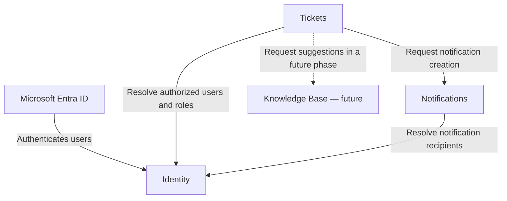

# Nexus Support Lite

## Domain Boundaries

**Status:** Discovery validated  
**Version:** 1.0  
**Date:** August 1, 2026  
**Related documents:** `PRODUCT.md`, `PERSONAS.md`, `USER_FLOWS.md`, `SYSTEM_CONTEXT.md`, `CONTAINER_DIAGRAM.md`, `DEPLOYMENT_DIAGRAM.md`

## 1. Purpose

This document defines the business boundaries, responsibilities, data ownership, allowed dependencies, and integration rules of Nexus Support Lite. It separates the MVP domains from future capabilities without coupling them to a particular Azure runtime or implementation framework.

When this document differs from an earlier Discovery statement, the latest explicitly validated decision recorded here takes precedence for domain design. The affected source document must be synchronized before implementation.

## 2. Domain Map

| Domain | MVP status | Primary responsibility | Authoritative data |
| --- | --- | --- | --- |
| Identity | Included | Establish organizations, local users, roles, account state, and relationships with external identity providers. | Organizations, IdP configuration, users, roles, account state. |
| Tickets | Included | Manage the complete operational lifecycle of support incidents and their routing. | Topics, responsible agents, incidents, priorities, assignments, comments, resolutions, history, attachment references. |
| Notifications | Included | Create and maintain in-app notifications for Nexus users. | Recipients, notification content and references, creation history, read/unread state. |
| Knowledge Base | Future | Manage support knowledge and provide AI-assisted topic and priority suggestions. | Knowledge articles or sources, indexing metadata, AI recommendation context and results, subject to later Discovery. |

Knowledge Base and every AI-assisted capability are outside the MVP. Their presence in this domain map prepares an architectural boundary; it does not authorize their implementation in the first version.

## 3. Context Map

The arrows represent allowed domain integrations, not shared persistence. Calls between MVP services use APIs and HTTP according to `CONTAINER_DIAGRAM.md` and `DEPLOYMENT_DIAGRAM.md`.

## 4. Identity Domain

### 4.1 Responsibilities

- Register and enable organizations configured by a Nexus Global Administrator.
- Maintain the identity-provider configuration associated with each organization.
- Identify an organization from the authenticated tenant ID.
- Reject access when the tenant is unknown or the organization is disabled.
- Delegate initial authentication to Microsoft Entra ID in the first phase.
- Synchronize the authenticated user's name and email.
- Provision a first-time local user with the Requester role.
- Maintain local users, roles, account state, and the user's active-role capabilities.
- Preserve tenant isolation for all Identity-owned operations.
- Support future IdP integrations without transferring local authorization ownership to those providers.

### 4.2 Outside the Boundary

Identity does not own:

- Incident topics or the agents responsible for them.
- Incidents, assignments, priorities, comments, resolutions, or history.
- Notification history or read/unread state.
- Authentication credentials managed by an external IdP.
- Knowledge Base content or AI recommendations.

### 4.3 Business Invariants

- Every local user belongs to exactly one Nexus organization within a tenant context.
- A newly provisioned user receives the Requester role.
- A disabled organization or unknown tenant cannot access tenant capabilities.
- The Nexus Global Administrator can manage organization and identity configuration but cannot use Identity as a path to tenant operational data.
- Authentication by the IdP does not by itself grant operational permissions; Nexus roles and account state remain authoritative locally.

## 5. Tickets Domain

### 5.1 Responsibilities

- Manage topics and their responsible-agent relationships.
- Create and query incidents within the active organization.
- Enforce the lifecycle **New → In Progress → Closed**.
- Manage priority, assignment, delegation, topic transfer, comments, resolution, and closure.
- Perform atomic incident-taking so two agents cannot acquire the same incident.
- Record the auditable history of ticket-domain actions.
- Own attachment metadata, references, and lifecycle rules even if file bytes later use specialized storage.
- Enforce tenant, role, topic, assignment, and workflow rules for every operation.
- Request internal notification creation after committing relevant ticket changes.

### 5.2 Outside the Boundary

Tickets does not own:

- Organization, user, role, or IdP configuration.
- Authentication or first-access provisioning.
- Notification persistence or read/unread state.
- Support knowledge, AI models, or AI-generated topic and priority suggestions in the MVP.
- Another domain's database or internal data model.

### 5.3 Business Invariants

- Every incident belongs to exactly one organization and one topic.
- A New incident has no individual assignee.
- An In Progress incident always has one current assignee.
- A Closed incident has a required resolution description.
- Taking an incident is atomic.
- Topic transfer removes the current assignment and returns the incident to New.
- Only the permitted actor may execute an operation, based on the latest validated role and topic rules.
- A failure to create a notification cannot roll back an already committed ticket change.

## 6. Notifications Domain

### 6.1 Responsibilities

- Accept requests to create in-app notifications.
- Determine and validate recipients using explicit notification rules and Identity-provided user references when required.
- Persist notification records and their relationship to recipients.
- Maintain notification history and read/unread state.
- Provide the pending-notification count used by the application bell.
- Return only notifications belonging to the authenticated organization and authorized user.

### 6.2 Outside the Boundary

Notifications does not own:

- The ticket operation that caused a notification.
- Incident lifecycle, comments, assignments, or topic membership.
- User roles, local account state, or IdP configuration.
- Email, SMS, or push delivery in the MVP.
- Business rollback or compensation for a successful ticket operation.

### 6.3 Business Invariants

- Each notification belongs to one organization and at least one intended recipient according to the eventual notification model.
- Read/unread state is changed only through the Notifications domain.
- A user cannot read or mutate another user's notification state unless a later validated requirement explicitly permits it.
- Notification data cannot expose ticket details beyond the minimum reference and display information required by the user experience.
- The MVP accepts that a notification may be delayed or absent after controlled HTTP retries are exhausted.

## 7. Knowledge Base Domain — Future

### 7.1 Intended Responsibilities

In a future phase, this domain may:

- Maintain curated support knowledge and its lifecycle.
- Search or retrieve relevant knowledge for support scenarios.
- Use historical and contextual knowledge to suggest an incident topic.
- Suggest an incident priority from the information supplied by the requester.
- Return recommendations with enough metadata for the interface to present them as suggestions rather than decisions.
- Degrade gracefully so an unavailable recommendation never blocks incident creation.

### 7.2 Boundary Conditions

- Knowledge Base and AI suggestion capabilities are not part of the MVP.
- Tickets remains authoritative for the topic and priority ultimately selected by a person.
- Knowledge Base cannot create, assign, transfer, prioritize, or close an incident directly.
- No Knowledge Base database, API, model, provider, index, embedding store, or deployment resource should be created until the future scope is validated.
- Training-data use, retention, privacy, provider selection, evaluation, and human-oversight controls require separate Discovery and ADRs.

## 8. Ownership and Reference Rules

Each domain owns its data exclusively. Cross-domain relationships use stable identifiers and APIs rather than replicated writable business records.

| Information needed by another domain | Authoritative owner | Allowed consumption pattern |
| --- | --- | --- |
| Organization identity and status | Identity | Validate or resolve through an Identity contract; cache only under a documented consistency policy. |
| User identity, account state, and roles | Identity | Use stable user identifiers and an Identity contract. |
| Topic and responsible-agent membership | Tickets | Query through a Tickets contract; Notifications must not maintain an independently editable copy. |
| Incident state and current assignee | Tickets | Reference by incident ID or retrieve through an authorized Tickets contract. |
| Notification history and read state | Notifications | Query and mutate only through a Notifications contract. |
| Future knowledge and recommendations | Knowledge Base | Request a recommendation; Tickets stores only the human-selected operational result and any later-approved audit reference. |

Duplication for performance is permitted only as a derived, non-authoritative projection with explicit synchronization and tenant-isolation rules. It never grants write ownership.

## 9. Integration Rules

- No domain may read, join, or mutate another domain's database.
- Every request crossing a boundary must carry or resolve trusted tenant context.
- The receiving domain enforces authorization and tenant isolation; it cannot rely solely on the caller or frontend.
- Contracts expose business identifiers and outcomes, not internal persistence schemas.
- Ticket-to-Notification communication uses HTTP with controlled timeouts and retries in the MVP.
- A notification request occurs after the ticket change is committed.
- Exhausted notification retries are recorded for operational visibility; they do not change the ticket result.
- Asynchronous messaging may be introduced later only when delivery guarantees, fan-out, load, or decoupling requirements justify it.
- Inter-domain failure, timeout, retry, idempotency, and versioning policies require focused ADRs before implementation.

## 10. Dependency Constraints

The MVP dependencies are intentionally directional:

- Identity depends on Microsoft Entra ID for external authentication but owns Nexus authorization data.
- Tickets may consume Identity capabilities but Identity does not depend on Tickets.
- Notifications may consume Identity references and receives notification requests from Tickets.
- Tickets does not depend on successful notification persistence to complete its own transaction.
- Knowledge Base may later consume limited ticket context under an explicit contract; Tickets must continue working when Knowledge Base is unavailable.

Circular synchronous dependencies should be avoided. If implementation reveals a cycle, the boundary or interaction must be reconsidered and documented rather than solved through direct database access.

## 11. MVP Scope

### Included

- Identity domain.
- Tickets domain.
- Notifications domain.
- Microsoft Entra ID as the initial external IdP.
- HTTP integration between the MVP domains.
- Separate data ownership and persistence per microservice.

### Excluded or Deferred

- Knowledge Base functionality.
- AI-based topic and priority suggestions.
- Additional IdP implementations beyond Entra ID.
- Event broker or asynchronous domain integration.
- Email or external notification channels.
- Shared databases or cross-service table access.

## 12. Required Documentation Synchronization

Before implementation:

- `PRODUCT.md` must move Knowledge Base and AI-based topic and priority suggestions out of the first-version flow and into a future phase.
- `PRODUCT.md` and `USER_FLOWS.md` must adopt the tenant-ID access flow established in `SYSTEM_CONTEXT.md` instead of the earlier email-based organization-resolution flow.
- Notification recipient rules must remain aligned with the latest validated `USER_FLOWS.md`, including exceptions such as topic-transfer behavior.
- Future diagrams must not deploy or imply a Knowledge Base or AI container as part of the MVP.

## 13. Unresolved Domain Decisions

- Exact API contracts between Identity, Tickets, and Notifications.
- Authorization policy evaluation and propagation across services.
- Strategy for immediate role and topic-membership changes during active sessions.
- Idempotency and retry policy for notification creation.
- Notification payload minimization and safe rendering of ticket references.
- Attachment storage, scanning, retention, and deletion implementation.
- Audit-data ownership where actions span more than one domain.
- Criteria and contracts for introducing asynchronous messaging.
- Knowledge Base content lifecycle, AI provider, recommendation contract, evaluation, and governance.

## 14. Domain-Level Acceptance Criteria

1. Every business capability in the MVP has one authoritative domain owner.
2. Identity, Tickets, and Notifications persist only their owned data.
3. No service reads or writes another service's database.
4. Every cross-domain operation enforces organization isolation.
5. Tickets remains valid and committed when Notifications is unavailable.
6. Notifications exclusively owns notification history and read/unread state.
7. Tickets exclusively owns incident lifecycle, assignment, topic, priority, comment, resolution, and history rules.
8. Identity exclusively owns organizations, IdP configuration, local users, roles, and account state.
9. Knowledge Base and AI suggestion capabilities are absent from the MVP implementation and deployment.
10. A future Knowledge Base recommendation cannot override the topic or priority selected by a person.

## 15. Next Architecture Work

The next recommended artifacts are focused Architecture Decision Records (ADRs). The first ADRs should address the Azure container execution platform, service authentication and tenant propagation, API Gateway approach, notification retry and idempotency policy, and observability stack.
