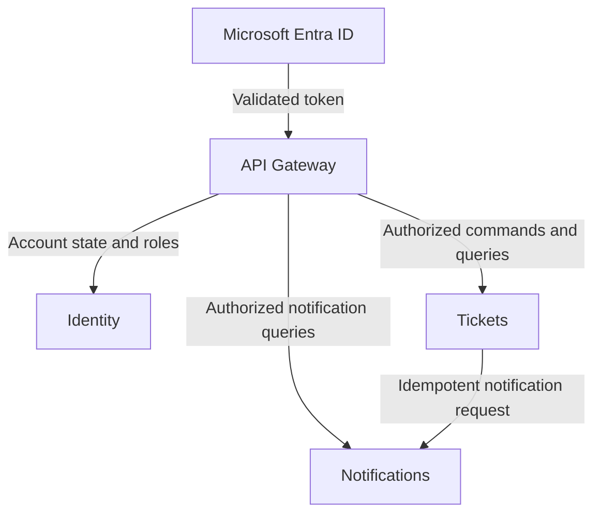

# Nexus Support Lite

## Domain Boundaries

**Status:** Architecture synchronized  
**Version:** 2.0  
**Date:** August 1, 2026  
**Related documents:** `PRODUCT.md`, `PERSONAS.md`, `USER_FLOWS.md`, `SYSTEM_CONTEXT.md`, `CONTAINER_DIAGRAM.md`, `DEPLOYMENT_DIAGRAM.md`, `ADR-001-MICROSERVICES-ARCHITECTURE.md`, `ADR-002-MULTITENANT-IDENTITY.md`, `ADR-003-PERSISTENCE-STRATEGY.md`, `ADR-004-API-GATEWAY-WITH-YARP.md`

## 1. Purpose

This document defines the business boundaries, data ownership, allowed dependencies, and integration rules of Nexus Support Lite. Infrastructure placement belongs in `DEPLOYMENT_DIAGRAM.md`; this document remains centered on domain responsibility.

## 2. Domain Map

| Domain | MVP status | Primary responsibility | Authoritative data |
| --- | --- | --- | --- |
| Identity | Included | Organizations, local users, account state, roles, and the association with validated Entra tenants. | Organizations, users, roles, account state, tenant registration. |
| Tickets | Included | Operational lifecycle and routing of support incidents, including reliable notification-delivery intent. | Topics, responsible agents, incidents, priorities, assignments, comments, resolutions, history, attachment references, pending notification deliveries. |
| Notifications | Included | Persistent in-app notifications for Nexus users. | Recipients, notification content and references, operation identifiers, history, read/unread state. |
| Knowledge Base | Future | Potential support knowledge and AI-assisted capabilities, subject to later Discovery. | No MVP data or deployment. |

Knowledge Base and all AI-assisted capabilities are outside the MVP. Their presence here reserves a future boundary only.

## 3. Context Map

The Gateway is an application boundary, not a business domain. It authenticates end-user requests and propagates trusted identity context; each receiving domain enforces its own functional authorization.

## 4. Identity Domain

### Responsibilities

- Register and enable organizations configured by a Nexus Global Administrator.
- Associate each organization with the validated Microsoft Entra tenant identifier.
- Reject unknown or disabled organizations when queried by the Gateway.
- Provision a first-time local user with the Requester role using validated identity data.
- Maintain local users, roles, account state, and active-role capabilities.
- Provide local account state and roles to the Gateway.
- Trigger immediate Gateway-cache invalidation after relevant role or account-state changes.
- Preserve tenant isolation for all Identity-owned operations.

### Outside the boundary

Identity does not own end-user token validation, API routing, incident data, topic membership, notification history, external IdP credentials, Knowledge Base content, or AI recommendations.

### Invariants

- A local user is scoped to one Nexus organization within a tenant context.
- A newly provisioned user receives the Requester role.
- Unknown or disabled organizations cannot access tenant capabilities.
- Microsoft Entra authentication does not grant Nexus operational permissions by itself.
- Nexus roles and account state remain authoritative locally.
- The Nexus Global Administrator cannot use Identity as a path into tenant operational data.

## 5. Tickets Domain

### Responsibilities

- Manage topics and responsible-agent relationships.
- Create and query incidents within the trusted organization.
- Enforce the lifecycle **New → In Progress → Closed**.
- Manage priority, assignment, delegation, topic transfer, comments, resolution, and closure.
- Perform atomic incident-taking.
- Record auditable ticket-domain history.
- Own attachment metadata, references, and lifecycle rules.
- Enforce tenant, role, topic, assignment, and workflow rules.
- Request notification creation only after committing the ticket change.
- Generate a unique operation identifier for each notification request.
- Persist durable pending deliveries after immediate attempts fail.
- Own retry state: attempt count, next attempt, last error, and terminal `Failed` status.
- Operate the Notification Retry Function as a component of the Tickets domain.

### Outside the boundary

Tickets does not own organizations, users, roles, authentication, first-access provisioning, notification history, read/unread state, Knowledge Base content, AI models, or another domain's persistence model.

### Invariants

- Every incident belongs to exactly one organization and one topic.
- A New incident is unassigned.
- An In Progress incident has one current assignee.
- A Closed incident has a required resolution description.
- Taking an incident is atomic.
- Topic transfer requires justification, removes assignment, and returns the incident to New.
- Delegation is limited to responsible agents of the current topic.
- A notification failure never rolls back an already committed ticket change.
- Pending delivery records belong to Tickets even though successful notifications belong to Notifications.

## 6. Notifications Domain

### Responsibilities

- Accept idempotent requests to create in-app notifications.
- Use the operation identifier to prevent duplicates.
- Validate recipients under explicit notification rules.
- Persist notification records and recipient relationships.
- Maintain persistent history and read/unread state.
- Provide notification lists and pending counts for the authenticated user.
- Return only data matching the trusted `TenantId` and `UserId`.

### Outside the boundary

Notifications does not own the ticket operation, incident workflow, assignments, topic membership, user roles, account state, IdP configuration, retry scheduling, email, SMS, push delivery, or compensation for a ticket operation.

### Invariants

- Each notification belongs to one organization and intended user.
- Notification storage is partitioned logically by `TenantId` and `UserId`.
- Read state changes do not delete notification history.
- A user cannot read or mutate another user's notification state.
- Duplicate operation identifiers do not create duplicate notifications.
- Notification content contains only the minimum ticket reference and display information needed by the UI.

## 7. Knowledge Base — Future

A future boundary may own curated support knowledge, retrieval, and topic or priority suggestions. It is not authorized for the MVP:

- No Knowledge Base API, database, container, model, provider, index, embedding store, or vector database is deployed.
- Tickets remains authoritative for human-selected topic and priority.
- Future recommendations cannot directly create, assign, transfer, prioritize, or close incidents.
- Provider selection, privacy, retention, evaluation, and human oversight require separate Discovery and ADRs.

## 8. Ownership and Reference Rules

| Information | Authoritative owner | Allowed consumption |
| --- | --- | --- |
| Organization registration and status | Identity | Gateway queries Identity; five-minute cache with immediate invalidation after changes. |
| User identity, account state, and roles | Identity | Gateway obtains and propagates trusted identity context. |
| Topic and responsible-agent membership | Tickets | Tickets contracts only; no editable copy in Notifications. |
| Incident state and assignee | Tickets | Stable incident references or authorized Tickets contracts. |
| Pending notification delivery and retries | Tickets | Ticket Service and its Retry Function only. |
| Notification history and read state | Notifications | Notifications contracts only. |
| Future knowledge and recommendations | Future Knowledge Base | Not consumed in the MVP. |

Cross-domain references use stable identifiers and APIs. Any derived projection is non-authoritative, tenant-scoped, and read-only with respect to the source domain.

## 9. Integration Rules

- No domain reads, joins, or mutates another domain's database.
- The Gateway removes untrusted client identity headers and supplies trusted user, `TenantId`, and role headers after token validation.
- Gateway-to-service calls include a distinct internal key for the destination service.
- Each receiving microservice validates its internal key and enforces functional authorization and tenant isolation.
- Tickets calls Notifications through internal HTTP only after its transaction commits.
- Notification requests carry unique operation identifiers and are idempotent.
- Immediate calls use Polly timeouts, exponential-backoff retries, configurable maximum attempts, and circuit breaker.
- After immediate failure, Tickets stores a durable pending delivery.
- The Azure Function polls pending deliveries initially every minute and retries them.
- Exhausted deliveries become `Failed` for manual review.
- Function-to-Notifications authentication remains **TBD**.
- Azure Service Bus and other brokers are outside the MVP.

## 10. Dependency Constraints

- The Gateway depends on Microsoft Entra ID for token validation and on Identity for Nexus account state and roles.
- Identity does not depend on Tickets or Notifications.
- Tickets depends on the trusted identity context supplied by the Gateway, not on direct access to Identity data.
- Notifications receives end-user identity context from the Gateway and notification requests from the Tickets domain.
- Tickets does not depend on successful notification persistence to complete its transaction.
- Circular synchronous dependencies and cross-database access are prohibited.

## 11. Persistence Boundaries

- Identity owns a dedicated Azure SQL database.
- Tickets owns a separate Azure SQL database, including pending notification deliveries.
- Notifications owns Azure Cosmos DB with Session consistency and hierarchical partitioning by `TenantId` and `UserId`.
- Identity and Tickets share a database per service across organizations and isolate records by `TenantId`.
- Each service uses its own managed identity and least-privilege data permissions.
- The Retry Function uses a distinct managed identity with limited access to Tickets-owned pending deliveries.
- SQL migrations execute as controlled CI/CD pipeline steps.

## 12. MVP Scope

### Included

- Identity, Tickets, and Notifications domains.
- Microsoft Entra ID organizational authentication through the Gateway.
- Gateway-propagated trusted identity context.
- HTTP integration, idempotency, Polly resilience, durable pending deliveries, and the Timer-triggered Retry Function.
- Separate domain-owned persistence.

### Excluded or deferred

- Knowledge Base and AI capabilities.
- Additional external identity providers.
- Service Bus or another broker.
- Email, SMS, or push notifications.
- Shared databases or cross-service table access.

## 13. Remaining Domain Decisions

Only the following unresolved items affect these boundaries:

- Exact versioned API contracts and payload schemas.
- Retry Function authentication to Notification Service.
- Notification payload minimization and safe rendering.
- Attachment byte storage, scanning, retention, and deletion.
- Cross-domain audit correlation.
- Future criteria for introducing messaging or Knowledge Base capabilities.

Rate limiting, identity propagation, role caching, persistence, idempotency, retry ownership, and broker exclusion are already decided and must not be reopened implicitly.

## 14. Acceptance Criteria

1. Every MVP capability has one authoritative domain owner.
2. Identity, Tickets, and Notifications persist only owned data.
3. No service reads or writes another domain's database.
4. Every operation enforces trusted organization isolation.
5. Tickets remains committed when Notifications is unavailable.
6. Pending delivery state belongs to Tickets; notification history belongs to Notifications.
7. Retry processing can run independently without crossing domain ownership.
8. Identity owns organizations, users, Nexus roles, and account state; the Gateway owns end-user token validation.
9. Knowledge Base, AI, Service Bus, and other brokers are absent from the MVP.
10. Unresolved integration details remain explicit rather than inferred.

## 15. Documentation Status

Remaining synchronization work:

1. Record the validated Ticket-to-Notification decisions in `ADR-005`.
2. Synchronize `PRODUCT.md`.
3. Synchronize `USER_FLOWS.md`.
