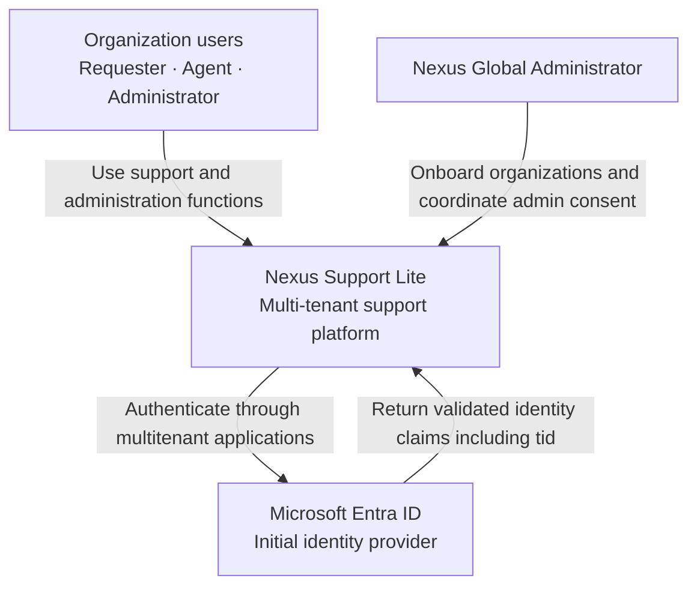

# Nexus Support Lite

## System Context

**Status:** Discovery validated  
**Version:** 1.1  
**Date:** August 1, 2026  
**Related documents:** `PRODUCT.md`, `PERSONAS.md`, `USER_FLOWS.md`

## 1. Purpose

This document defines the system boundary of Nexus Support Lite, the people who interact with it, the external systems required by the initial version, and the principal relationships between them.

It does not define internal applications, services, databases, deployment units, or implementation technologies. Those decisions belong in `CONTAINER_DIAGRAM.md`, `DEPLOYMENT_DIAGRAM.md`, and the relevant Architecture Decision Records.

## 2. System of Interest

Nexus Support Lite is a multi-tenant web platform that centralizes and tracks internal IT support incidents for organizations from different industries.

Each organization operates within an isolated tenant. Its users, roles, topics, incidents, comments, attachments, history, notifications, configurations, and reports must remain inaccessible to every other organization.

## 3. People

The human context, goals, frustrations, and usage patterns of the primary users are defined in `PERSONAS.md`. Their permissions and detailed interactions are defined in `PRODUCT.md` and `USER_FLOWS.md`.

| Person | Relationship with Nexus Support Lite |
| --- | --- |
| Requester | Registers incidents and follows their status, comments, assignee, and resolution within their organization. |
| Agent | Handles incidents associated with their assigned topics and records the work performed. |
| Organization Administrator | Maintains users, roles, and topics and consults operational information within their organization. |
| Nexus Global Administrator | Onboards and enables organizations and coordinates administrative consent for Nexus. This person belongs to the Nexus provider and cannot access tenant operational data. |

## 4. External Systems

### 4.1 Microsoft Entra ID

Microsoft Entra ID is the only identity provider integrated in the initial phase. Nexus accepts organizational Entra ID accounts only; personal Microsoft accounts are excluded.

Nexus uses two shared multitenant App Registrations:

- One App Registration for the web frontend.
- One App Registration for the API.

Each customer organization grants administrative consent to these applications during onboarding. Nexus does not maintain a separate App Registration or identity-provider connection for each organization.

After Microsoft Entra ID authenticates the user, the Nexus API Gateway validates the token and resolves the organization exclusively from the validated `tid` claim. A tenant identifier supplied separately by the browser or frontend is never trusted. Entra ID also provides the authenticated user's basic profile, initially name and email address.

Nexus remains responsible for tenant admission, local account status, role authorization, topic authorization, and data isolation.

### 4.2 Future Identity Providers

The product is expected to support additional identity providers in later phases. This is an architectural extensibility requirement, not an initial external integration. No provider other than Microsoft Entra ID is selected or implemented in the first phase.

### 4.3 User Web Browser

All people access Nexus through a web browser. The product is a responsive web application; native mobile applications are outside the initial scope.

### 4.4 Systems Explicitly Outside the Initial Context

The initial version has no integration with email, Microsoft Teams, or external messaging systems. Notifications are generated and consumed only within Nexus.

The initial version also does not ingest incidents automatically from Teams, email, or other external channels.

## 5. Context Diagram

The diagram shows only the initial external context. Future identity providers are excluded because none has yet been selected.

## 6. Organization Onboarding and Access Context

1. The Nexus Global Administrator registers and enables an organization before its users can access Nexus.
2. An administrator of the customer organization grants administrative consent to the Nexus frontend and API App Registrations.
3. A user signs in with an organizational Microsoft Entra ID account.
4. The API Gateway validates the token and Nexus identifies the organization exclusively from its `tid` claim.
5. Nexus rejects access when the `tid` is unknown or the organization is disabled and informs the user that the organization is not enabled.
6. Any successfully authenticated user from an enabled tenant may enter Nexus without prior manual creation by an organization administrator.
7. On first access, Nexus creates the local user automatically with the **Requester** role.
8. Nexus synchronizes the user's name and email address from Entra ID during sign-in.
9. Subsequent access and actions remain subject to the local account status, assigned roles, topic membership, and tenant authorization rules defined in `USER_FLOWS.md`.

## 7. Trust and Security Boundaries

### 7.1 Identity Boundary

- Nexus uses shared multitenant App Registrations rather than a separate identity-provider configuration for each organization.
- Only organizational Microsoft Entra ID accounts are accepted.
- The customer organization must grant administrative consent during onboarding.
- Microsoft Entra ID authenticates the person; the Nexus API Gateway validates the token; Nexus authorizes what that person may do.
- The organization is derived exclusively from the validated `tid` claim, never from a tenant identifier supplied by the frontend.
- An authenticated identity alone does not grant access to an unregistered or disabled organization.
- A locally deactivated user must not retain access even if Entra ID authenticates them successfully.

### 7.2 Tenant Boundary

- The authenticated tenant context must be established before operational data is accessed.
- Every request and data operation must be constrained to the active organization.
- Tenant users and administrators cannot access another organization's operational or configuration data.
- The Nexus Global Administrator can manage tenant and identity configuration but cannot view incidents, comments, attachments, histories, notifications, or reports belonging to an organization.

### 7.3 Application Boundary

- Incident data, notification delivery, notification history, and user-facing audit information remain inside Nexus in the initial version.
- The browser is an untrusted client; tenant and authorization checks must be enforced by Nexus rather than relying on the user interface.

## 8. Key Context-Level Requirements

1. Nexus must support multiple organizations on the same platform with complete tenant isolation.
2. Nexus must use separate multitenant App Registrations for the frontend and API.
3. Customer organizations must grant administrative consent during onboarding.
4. Microsoft Entra ID organizational accounts must be supported in the initial phase; personal Microsoft accounts must be rejected.
5. The architecture must permit additional identity providers without making them part of the initial implementation scope.
6. The organization must be resolved exclusively from the validated `tid` claim.
7. Unknown or disabled organizations must be denied access.
8. A valid first-time user from an enabled tenant must be provisioned automatically as a Requester.
9. Name and email must be synchronized from Entra ID during sign-in.
10. Authentication, token validation, local user status, role authorization, topic authorization, and tenant authorization must remain distinct controls.
11. Initial notifications must remain internal to Nexus.
12. Identity-provider failure must prevent authentication but must not compromise or expose tenant information.

## 9. Context-Level Constraints and Non-Decisions

- No additional identity provider has been selected for implementation.
- No email or Teams integration is included in the initial version.
- No decision is made here about a backend architecture, API style, database, cloud provider, hosting model, or identity library.
- No decision is made here about whether tenants share physical infrastructure or storage. Only logical isolation is mandatory at this level.
- AI is an internal product capability from the user's perspective. Its provider and integration boundary remain pending technical design and should be resolved in the container design or an ADR.

## 10. Required Synchronization with Existing Documentation

The following newer Discovery decisions supersede or clarify portions of `PRODUCT.md` and must be synchronized there before implementation:

- Microsoft Entra ID is the sole identity provider integrated in the initial phase, while future multi-IdP support remains an architectural requirement.
- Nexus uses two shared multitenant App Registrations, one for the frontend and one for the API.
- Only organizational accounts are accepted; personal Microsoft accounts are excluded.
- The Nexus Global Administrator must register and enable the organization, and the customer organization must grant administrative consent before access is allowed.
- The API Gateway validates the token, and Nexus identifies the organization exclusively from the validated `tid` claim.
- An unknown `tid` or disabled organization causes access to be rejected.
- The earlier email-first organization-resolution flow in `PRODUCT.md` is not the current decision for the Entra ID initial flow and requires revision.
- Nexus synchronizes the user's name and email from Entra ID during sign-in.

## 11. Context-Level Acceptance Criteria

1. A user authenticated with an organizational Entra ID account from an enabled tenant is associated only with that organization.
2. Access is possible only after the customer organization grants administrative consent to both Nexus App Registrations.
3. A `tid` that is not registered cannot access Nexus.
4. A disabled organization cannot access Nexus even when Entra ID authentication succeeds.
5. A tenant identifier supplied by the browser or frontend cannot override the validated `tid` claim.
6. A valid first-time user is created automatically as a Requester with the name and email supplied by Entra ID.
7. A locally deactivated user cannot access Nexus even when the external identity remains valid.
8. Operational data from one organization is never returned to a user, administrator, or request associated with another organization.
9. The Nexus Global Administrator can manage organization onboarding without access to tenant operational data.
10. Users receive product notifications within Nexus and no notification is sent through email or Teams.

## 12. Next Architecture Document

The next recommended document is `CONTAINER_DIAGRAM.md`. It should define the major executable and data containers inside the Nexus boundary, their responsibilities, and their communication paths while preserving the identity and tenant boundaries established here.
